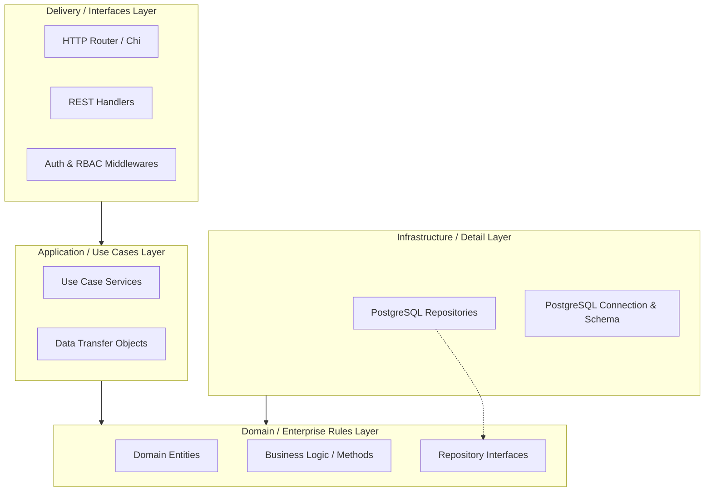
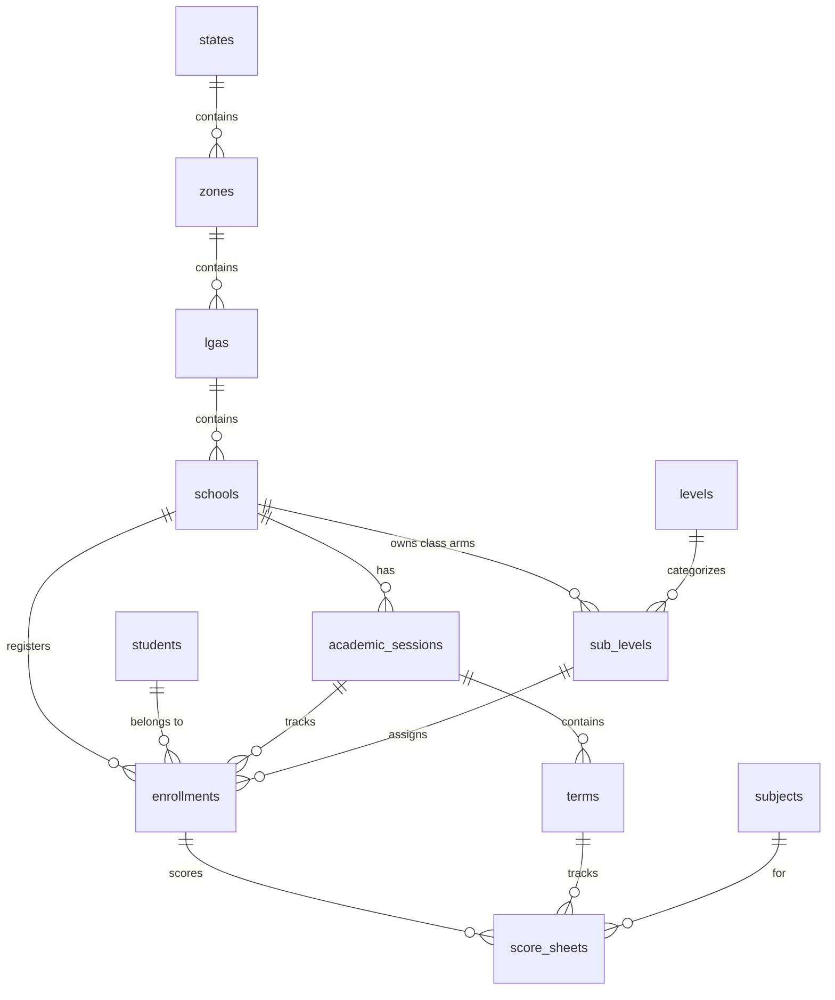

# e-Dossier Architecture Document

This document outlines the architectural patterns, layers, data flows, database design, and key engineering decisions in the e-Dossier API system.

---

## 🏛️ Architectural Overview

The e-Dossier API is structured according to **Clean Architecture** (or Hexagonal/Onion Architecture) principles. The codebase strictly decouples business rules from implementation details such as the database, HTTP framework, and third-party libraries.



### 1. Domain Layer (`internal/domain`)
The core of the application. It represents the enterprise business entities, value objects, and domain rules.
* **No Dependencies**: It has zero external dependencies on any frameworks, databases, or libraries. It uses standard Go types only.
* **Entities**: Contains database-mapped structs (e.g. `User`, `Student`, `School`, `Personnel`, `ScoreSheet`, `ReportCard`).
* **Domain Rules**: Contains core calculations and validations. For example, `ScoreSheet.ComputeTotal()` computes the total mark from continuous assessments (CA1, CA2, CA3) and the exam score.
* **Repository Interfaces**: Defines the contract specifications for data persistence (e.g., `UserRepository`, `StudentRepository`), which the infrastructure layer must implement.

### 2. Application Layer (`internal/application`)
Implements the use case scenarios of the system.
* **Use Cases**: Services under `internal/application/service` coordinate domain entities, invoke repository methods, perform application-specific validation, and handle transactions.
* **Data Transfer Objects (DTOs)**: Reside in `internal/application/dto`. They define incoming request and outgoing response payloads, decoupling presentation formats from the database model.

### 3. Infrastructure Layer (`internal/infrastructure`)
Implements the concrete details required by the application.
* **Database & Migrations**: Configures PostgreSQL connection pools (`internal/infrastructure/db/postgres.go`) and houses the schema definition. Migrations run automatically on server startup.
* **Repositories**: Implements the persistence interfaces defined in the domain layer using raw SQL queries to ensure maximum execution speed and efficiency.

### 4. Interfaces Layer (`internal/interfaces`)
The entry point for communication with the outside world.
* **HTTP Routing**: Leverages `go-chi/chi` to construct the API route trees.
* **REST Handlers**: Parses and validates HTTP request bodies/params, delegates the processing to application services, and structures JSON outputs.
* **Middleware**: Intercepts requests for authentication (JWT extraction), authorization (RBAC check), logging, and panic recovery.

---

## 💾 Database Schema & Relationships

The e-Dossier database uses PostgreSQL to store structural, academic, and administrative data. It is partitioned conceptually into several blocks:



### 1. Administrative Scope & Geography
* **`states`**: Top-level scope. All entities (users, personnel, levels, subjects) belong to a state.
* **`zones`**: Represents educational administrative zones within a state.
* **`lgas`**: Local Government Areas inside a zone.
* **`schools`**: Belongs directly to an LGA, establishing the `State -> Zone -> LGA -> School` chain.

### 2. Identity & RBAC (Role-Based Access Control)
* **`users`**: Principal accounts, scoped to a state and optionally to a school (school-level users vs. state-wide administrators).
* **`roles`**: Customizable roles (e.g. `TEACHER`, `PRINCIPAL`, `STATE_ADMIN`) scoped to a state.
* **`permissions`**: Granular resource-action combinations (e.g., `students:create`, `results:publish`).
* **`role_permissions`**: Many-to-many bridge mapping roles to granted permissions.
* **`user_roles`**: Many-to-many bridge mapping users to roles (optionally scoped to a specific school).

### 3. Academics & Scheduling
* **`academic_sessions`**: The school year (e.g., `2024/2025`), defined per school.
* **`terms`**: Three terms (1st, 2nd, 3rd) nested under a session.
* **`levels`**: State-wide grade definitions (e.g. `JSS 1`, `JSS 2`, `SS 1`).
* **`sub_levels`**: School-specific class arms (e.g. `JSS 1A`, `JSS 1B`), which reference a state-wide level.
* **`school_levels`**: Activates a state-wide level for a school during a specific academic session.

### 4. Personnel & Students
* **`personnel`**: Staff records (teachers, principals, etc.) with role assignments and biographical metadata.
* **`personnel_transfers`**: Audit log of historical staff movements between schools.
* **`students`**: Student records.
* **`enrollments`**: Active class memberships linking a student to a school, academic session, level, and class arm (sub-level).
* **`level_progressions`**: End-of-session promotion, repetition, and graduation decisions.

### 5. Scoring & Report Cards
* **`score_configs`**: Defines continuous assessment and examination maximum limits (e.g. CA1 = 10, CA2 = 10, CA3 = 10, Exam = 70) for a state or school.
* **`grade_configs`**: Mapping of score ranges to letter grades (e.g., A = 70-100, B = 60-69) and GPA points.
* **`score_sheets`**: Student grades per subject per term.
* **`report_cards`**: Aggregated end-of-term results showing total score, averages, class rank position, attendance, and teacher remarks.

---

## 🔒 Security & Authorization Model

### Authentication
e-Dossier uses stateless JWT authentication:
1. **Login**: User submits credentials to `/api/v1/auth/login`. If valid, the server returns an short-lived `access_token` (JWT) and a long-lived `refresh_token`.
2. **Access**: Clients include the access token in the `Authorization: Bearer <token>` header for protected routes.
3. **Refresh**: When the access token expires, clients call `/api/v1/auth/refresh` with the refresh token. The server verifies the token hash against the database and returns a new access token.

### Authorization (RBAC Middleware)
Access to protected routes is guarded by resource-based middlewares.
```go
r.With(authorize(d, "students", "create")).Post("/", d.Student.Create)
```
1. The `Authenticate` middleware verifies the access token and injects the `UserID`, `StateID`, and `SchoolID` into the request context.
2. The `Authorize` middleware queries the user's roles and permissions using the `UserRoleChecker` repo dependency.
3. It validates that the authenticated user possesses a role containing the required permission (e.g. resource: `students`, action: `create`).
4. **Data Ownership Check**: If the user is a school-scoped account (`school_id` is set), the handler layer ensures that the requested resource is owned by that specific school to prevent cross-tenant access.

---

## 💡 Key Design Decisions

### Manual Dependency Injection
Inside `cmd/server/main.go`, all services, repositories, and handlers are initialized and wired together manually:
* **Why?** It completely removes compilation overhead, eliminates complex setup code associated with DI reflection packages, and makes the application initialization trace completely readable.
* **Compile-time Safety**: Missing dependencies or type mismatches are caught during code compilation rather than at application runtime.

### Raw SQL Over ORM
Repositories interact with PostgreSQL directly using raw SQL queries:
* **Performance**: Raw SQL ensures database queries are optimized, utilizing custom joins and indexes without ORM hydration overhead.
* **Predictability**: It prevents N+1 query problems and makes it easy to write complex calculations, such as computing class positions inside `score_sheets` using window functions.
